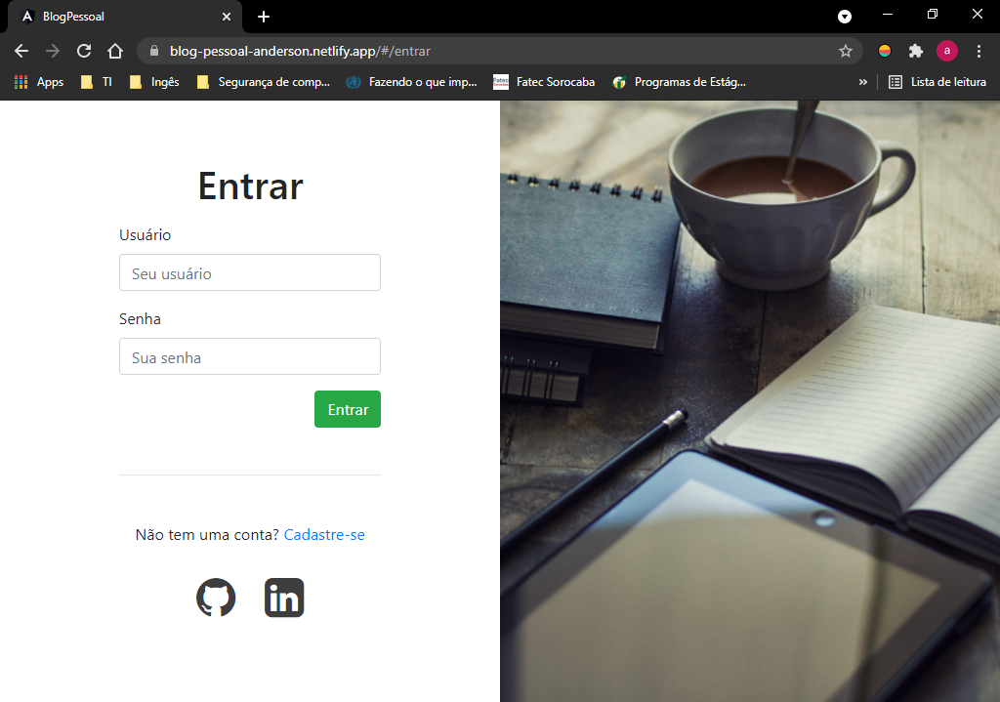
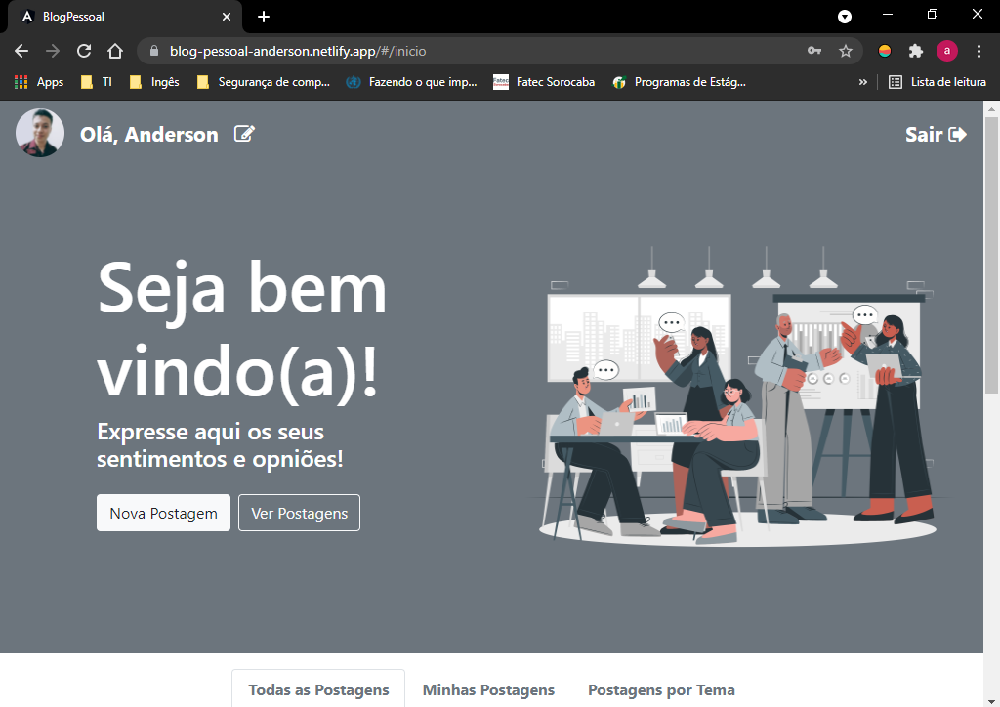
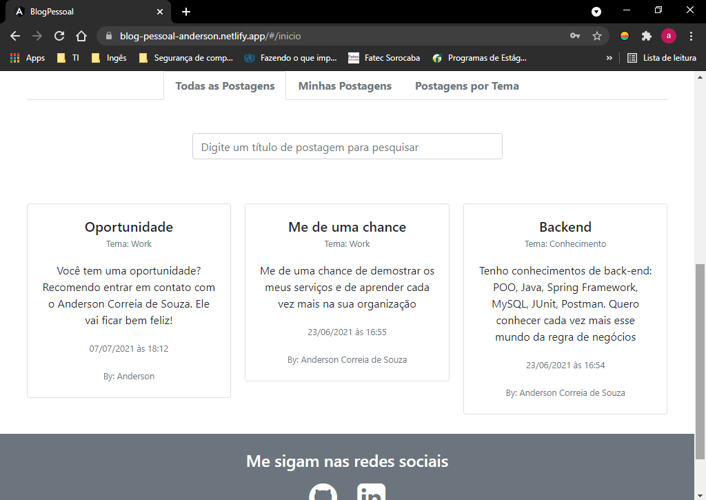
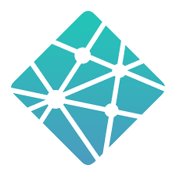

<h1 align="center">Blog Pessoal</h1>

Concluído 🚀

  <a href="#Sobre">Sobre</a> •
  <a href="#Funcionalidades">Funcionalidades</a> •
  <a href="#Executar">Como Executar</a> •
  <a href="#Tecnologias">Tecnologias</a> •
  <a href="#Autor">Autor</a> •
  <a href="#Licenca">Licença</a>

<h2 id="Sobre">:computer: Sobre o projeto</h2>

  Blog Pessoal: Este é um projeto front-end voltado para um blog pessoal, com ele você pode desabafar problemas, registrar uma bela conquista e guardar todos os momentos que você quiser da sua vida em formato de texto.

  Esse projeto foi um exercício da <a href="https://brazil.generation.org/">Generation Brasil</a> para que os alunos pudessem praticar os conhecimentos das tecnologias de front-end, ensinados no módulo 3 do curso.

<h2 id="Funcionalidades">⚙️ Funcionalidades</h2>

<h3>Usuário</h3>

  - [x] Cadastrar usuário
  - [x] Logar
  - [x] Alterar dados pessoais 

<h3>Postagem:</h3>

  - [x] Postar
  - [x] Consultar todas as postagens
  - [x] Consultar postagens com base no título
  - [x] Alterar postagem
  - [x] Deletar postagem

<h3>Tema</h3>

  - [x] Criar tema
  - [x] Consultar todos os temas
  - [x] Consultar tema por nome parecido
  - [x] Alterar cadastro de tema
  - [x] Deletar cadastro de tema

Tela de Login: 

Tela de Home: 

Tela de Postagens: 

<h2 id="Executar">🚀 Como executar o projeto</h2>

Para acessar o projeto clique <a href="https://blog-pessoal-anderson.netlify.app/#/entrar">aqui</a>. OBS: a API, que está sendo consumida, está no Heroku, então, pode ser que demore um pouco a primeira requisição.

Esse projeto consumiu essa <a href="https://github.com/Anderson815/Blog_Pessoal_-_API_REST">API - REST</a> também criada pelo Anderson.

<h2 id="Tecnologias">🛠 Tecnologias</h2>

Utilitários:

<h2 id="Autor">🦸 Autor</h2>

Anderson Correia é um entusiasta e apaixonados por programação, focado em resolver problemas através de códigos.

Esse projeto foi feito com muito ❤️ e carinho pelo Anderson 👋🏽 <a href="https://www.linkedin.com/in/anderson-correia/">Entre em contato!</a>

<h2 id="Licenca">📝 Licença</h2>

Este projeto esta sob a licença <a href="https://github.com/Anderson815/Blog_Pessoal_-_Front/blob/2db44066062ac66fd07d41e1f4c2b0b2375ea9e5/LICENSE">MIT</a>.

